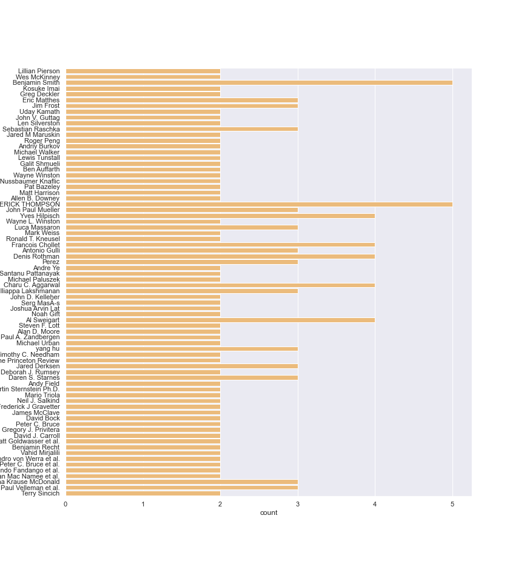
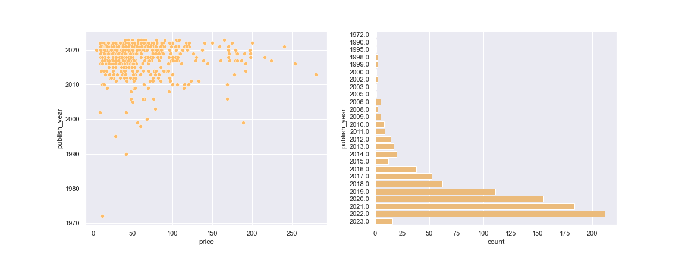
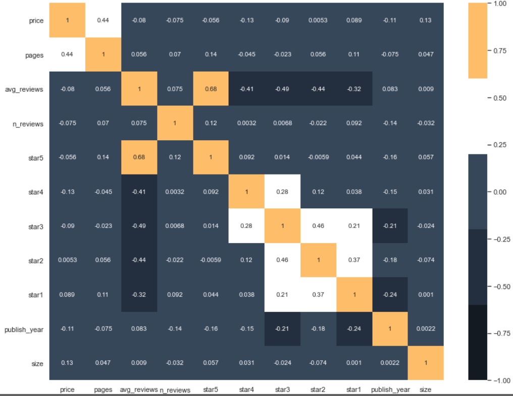
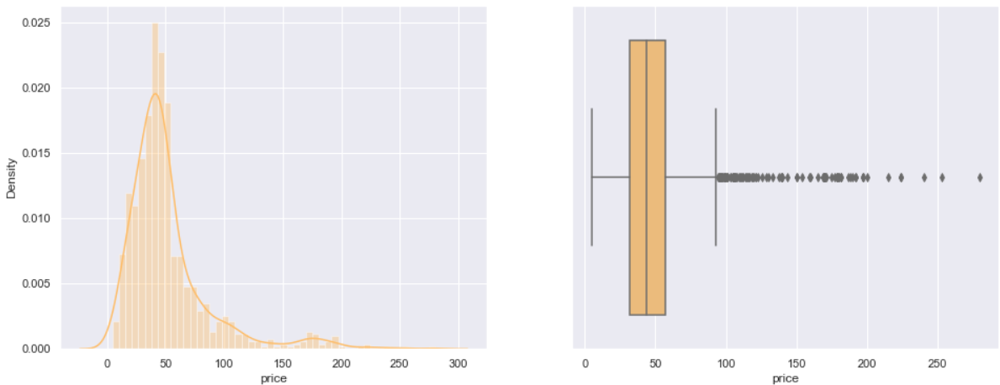
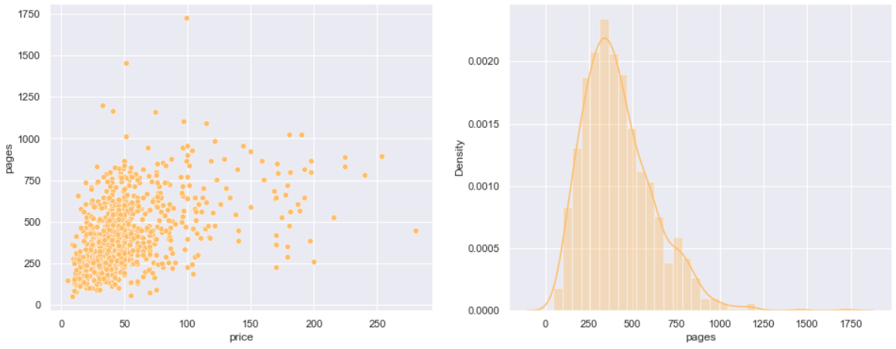
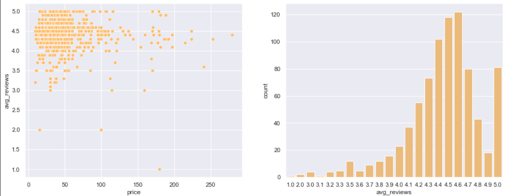
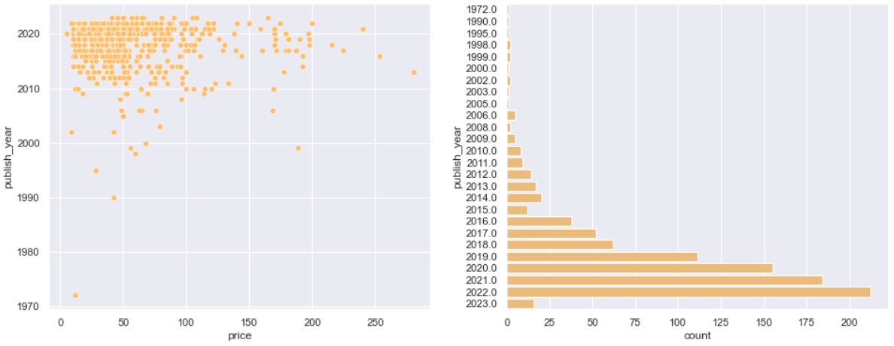
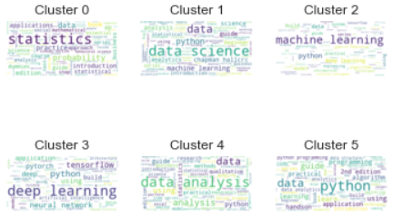
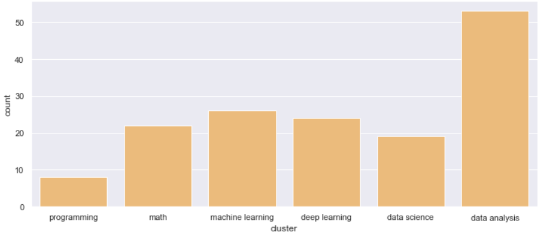

# Analyzing books related to Data science

# Overview :

  
  
  

**This project uses the Data science books dataset available on Kaggle https://www.kaggle.com/datasets/die9origephit/amazon-data-science-books.**
### The dataset contains 946 books obtained from scraping Amazon books related to data science, statistics, data analysis, Python, deep learning, and machine learning.

#### There are 18 columns :

- title: title of the book
- author: author (or the authors) of the book
- price: price (in dollars)
- pages: number of pages
- avg_reviews: average reviews (out of 5)
- n_reviews: reviews done for each book
- star5: percentage of 5 star reviews
- star4: percentage of 4 star reviews
- star3: percentage of 3 star reviews
- star2: percentage of 2 star reviews
- star1: percentage of 1 star reviews
- dimensions: size of the book (in inches)
- weight: weight (in pounds or ounces)
- language: language of the book
- publisher: publisher
- ISBN-13: ISBN_13 code
- link: link of the Amazon book
- complete_link: complete link of the Amazon book (including the domain https://amazon.com)

- ##  Loading the data 
- ##  Understanding the data
    - shape of the data
    - check column dtypes
    - check is there any null values
    
- ## Data preprocessing and feature engineering
  -  Split authors
  -  Convert weight from pounds and ounces to gr
  -  Extract publisher year from publisher
  -  Extract inch year from dimensions
  -  Remove punct from title
- ## Exploratory data analysis 
  - Authors with more than one books 
  - Correlation between features 
  - Price distrubtion
  - Whats the min avg max price 
  - Number of pages distrubtion
  - Does number of pages of a book affect the price ?
  - What's the most giving avg review ? 
  - Price vs avg_reviews
  - In what year have the most books been published ?
  - Price vs publish_year
  - Price vs weight (in gr)
- ## Clustring books by title
    - Apply TFIDF to books title
    - Find the best k for k means using Elbow method 
    - Apply kmeans clustring
    - Labling clusters
    - Tag books by titls
    - Best books in each cluster
    - Books price in each cluster
- ## Scrape reviews from amazon
- ## Summarizing reviews

## Interactive dashboard 
I used cleaned data and Streamlit in order to crreate a  interactive dashboard . By choosing the title of a desire book , we can see the book details and reviews

